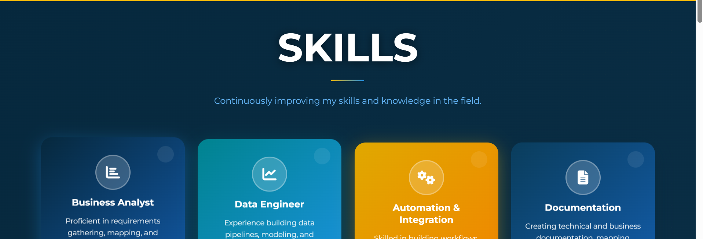
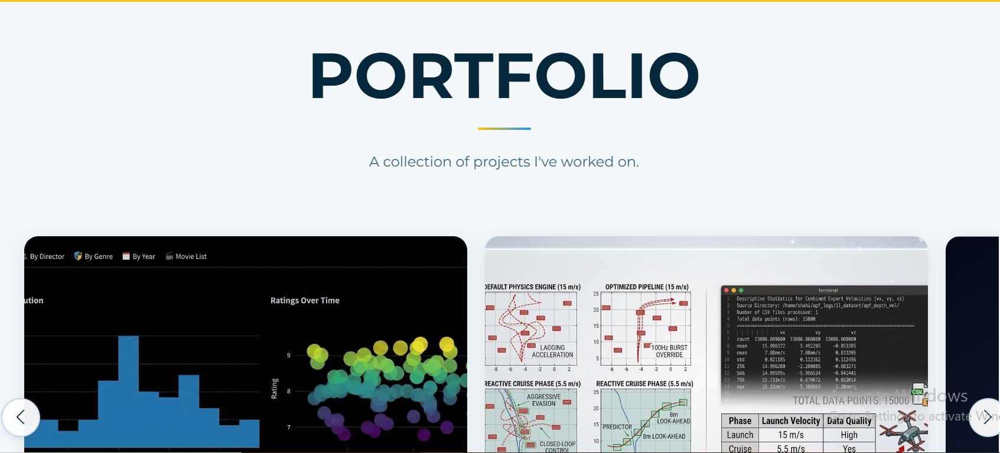
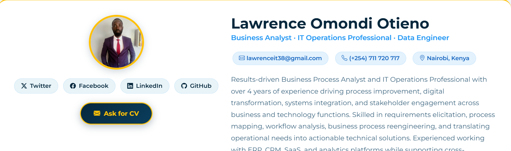
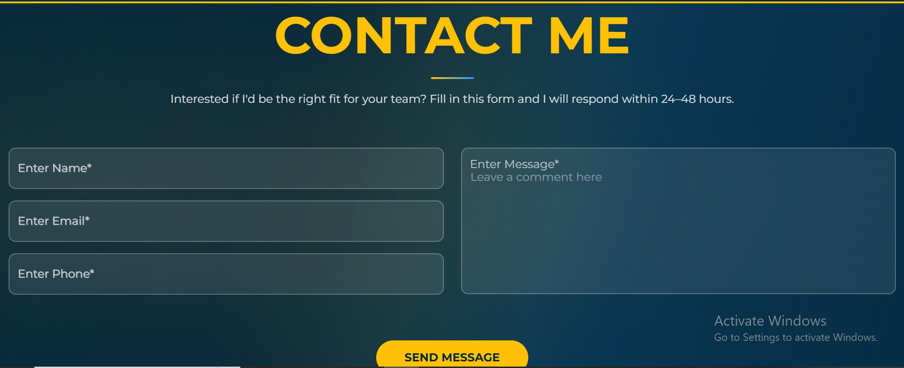

# Lawrence Otieno | Portfolio & Professional Showcase

A modern, fully responsive, and interactive personal portfolio web application built to highlight expertise in **Business Analysis**, **Basic IT Operations**, and **Data Engineering**. Designed with a mobile-first approach, it features smooth cross-platform sliding, responsive layouts, and an interactive tabbed resume interface.

## 🚀 Key Highlights

* **Business Analysis:** Showcasing end-to-end requirements gathering, stakeholder alignment, business process optimization, and detailed workflow mapping.
* **Basic IT Operations:** Highlighting infrastructure support, system monitoring, troubleshooting, and robust administrative workflows across enterprise environments.
* **Data Engineering & Analytics:** Demonstrating the design and deployment of scalable data pipelines, data modeling, automated ETL processes, and interactive analytical dashboards.

---

## 🛠️ Core Features

* **Interactive CV Section:** A modern tabbed interface allowing recruiters and clients to seamlessly toggle between Professional Summary, Work History, and Academic Background.
* **Mobile-Optimized Portfolio:** Custom touch-action handlers and CSS grid adjustments guaranteeing fluid, jank-free card swiping and viewing on smartphones and tablets.
* **Responsive Architecture:** Built using flexible breakpoints to ensure every section—from the hero banner to the timeline and contact form—scales gracefully.
* **Dynamic Typewriter Header:** An engaging, animated intro highlighting core disciplines.

---

## 💻 Tech Stack

- **Frontend:** HTML5, CSS3, JavaScript, Bootstrap 5, Font Awesome
- **Backend & Routing:** Flask (Python)
- **Version Control & Deployment:** Git, GitHub, Vercel

---

## 📸 Interface & Sections Showcase

### 1. Header & Professional Summary
A sleek introduction card highlighting core professional tracks, contact information, direct links to social profiles, and a call-to-action button to download the latest CV.
*   **Key Details Included:** Name, target roles, direct email (`lawrenceit38@gmail.com`), phone number, and social buttons (Twitter, Facebook, LinkedIn, GitHub).



### 2. Core Skills Directory
A grid layout composed of modular cards that breakdown domain specific technical proficiency and service offerings.
*   **Modules:** Business Analyst, Data Engineer, Automation & Integration, and Technical/Business Documentation.



### 3. Interactive Project Portfolio
A slider component displaying real-world data applications, physics simulation pipelines, optimization workflows, and custom analytics tools.
*   **Visual Highlights:** Integrated data visualization modules showing ratings over time, data telemetry logs, launch velocities, and responsive carousel navigation.



### 4. Asynchronous Contact Gateway
A clean user interface containing input fields coupled with validation constraints, engineered to let potential recruiters or clients submit inquiries effortlessly.
*   **Fields:** Full Name, Email Address, Phone Number, and Custom Message Textarea.



---

## ⚙️ Local Development Setup

To clone and run this application locally, follow these steps:

1. **Clone the repository:**
   ```bash
   git clone https://github.com
   cd YOUR_REPO_NAME
   ```

2. **Set up a virtual environment (Recommended):**
   ```bash
   python3 -m venv venv
   source venv/bin/activate  # On Windows use: venv\Scripts\activate
   ```

3. **Install dependencies:**
   ```bash
   pip install Flask
   ```

4. **Run the application:**
   ```bash
   python app.py
   ```
   Open your browser and navigate to `http://127.0.0`.

---

## 📄 License

This project is open-source and available under the [MIT License](LICENSE).
